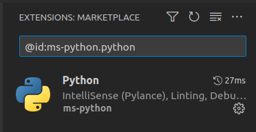

# vscode-extension-ids
Simple python parser to extract a list of installed extension ID's from VSCode and VSCodium

# Usage
The script has one required and one optional parameter

```
python3 main.py -f <filepath> -i
```

Filepath is the path to the extensions.json file. Most of the time you find them
- For VSCodium in: `~/.vscode-oss/extensions/extensions.json`
- For VSCode in: `~/.vscode/extensions/extensions.json`

The second parameter `-i` will add a prefix `@id:` to the output of the script. This is useful if you want to save the IDs to later copy-paste the extension name in the extensions marketplace search.



## Example usages

```
python3 main.py -f ~/.vscode-oss/extensions/extensions.json
```
output:
```
dsznajder.es7-react-js-snippets
ms-python.python
wayou.vscode-todo-highlight
```

### With `-i`

```
python3 main.py -f ~/.vscode-oss/extensions/extensions.json -i
```
output:
```
@id:dsznajder.es7-react-js-snippets
@id:ms-python.python
@id:wayou.vscode-todo-highlight
```

